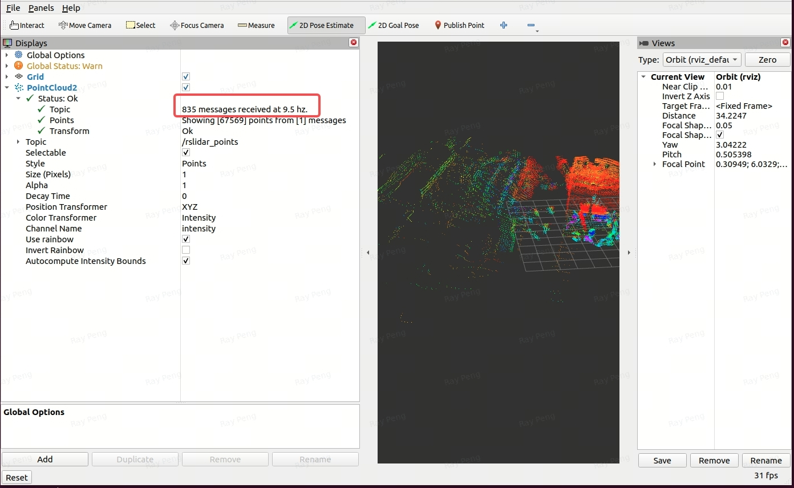

# 13 如何解决ROS2_humble帧率下降

## 1 节点生效法

该方法将DDS安装与环境变量配置植入到了rslidar_sdk的启动节点，并且仅在节点运行时生效，不影响全局环境，对安装了多种ros版本的环境较为友好，同时起到了对方案的封装。

将文件放置于与其他launch文件同级路径下，并通过与驱动教程中相同的方式启动节点，仅更改节点名称为humble_start.py。

 [humble_start.py](../../launch/humble_start.py)

```Bash
ros2 launch rslidar_sdk humble_start.py
```

节点启动时会提示用户输入sudo密码,DDS安装只会执行一次，不必担心后续启动节点反复安装.详情参考下方humble_Readme.md。

```LaTeX
#Readme#

Please put the humble_start.py file under the following directory the same as other start launch files:

/rslidar_sdk/src/rslidar_sdk/launch/
├── elequent_start.py
├── humble_start.py
├── humble_Readme.md
├── start.launch
└── start.py

After finishing the building of rslidar_sdk
use the following cmd to launch:

$ros2 launch rslidar_sdk humble_start.py$

*****
This start node is only used for ros2 humble version frame rate drop solution
It will prompt you for sudo authority to install the necessary DDS and set up new envs
The new DDS & new env variable are only effective when this node is running
Once the session is terminated, the new config should no longer be effective
```

## 2 全局更改法

运行以下脚本将在系统全局层面安装Cyclone DDS 并配置环境变量

 [dds_mod.sh](script/dds_mod.sh)

使用方法如下:

```
To run the setup script, first make sure it has execute permissions. You can do this by running the following command in your terminal:

$chmod +x dds_mod.sh$

After this, you can run the script using:

$source dds_mod.sh$
```

该脚本自动完成：

1. 安装新DDS
2. 配置环境变量

执行完毕，删除原来编译生成的文件夹，重新编译即可。

## 3 注意事项

当使用ros2 topic hz查询帧率结果异常时，建议使用rviz自带的帧率统计功能查看，或者通过其他的软件统计每秒内订阅到的消息个数。


